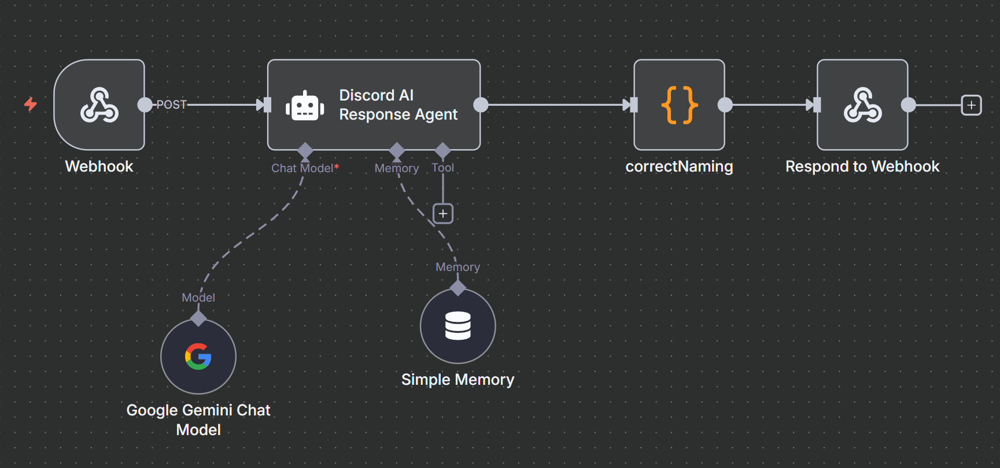

# Discord N8N Trigger

# Guide
This guide will help you set up and use the Discord N8N Trigger.

## N8N Setup

1. [Set Up a VPS](https://youtu.be/F-9KWQByeU0?si=idrEg3JvuCxr23Pd)
2. [Install n8n on your VPS](https://docs.n8n.io/getting-started/installation/)
3. [Video guide](https://youtu.be/ONgECvZNI3o?si=n_-jegtGBtzs9BZB)
4. [Use template](https://n8n.io/workflows/3456-automated-discord-chatbot-for-chat-interaction-in-channel-using-gemini-20-flash/)

## Discord Bot Setup

1. Create a new application in the [Discord Developer Portal](https://discord.com/developers/applications).
2. Add a bot to your application and copy the bot token.
3. Invite the bot to your server with the appropriate permissions.

## Workflow Setup

1. Create a new workflow in n8n.
2. Add a Discord Trigger node to your workflow.
3. Configure the trigger with your Discord bot token and other settings and credentials.
4. Add additional nodes to process the incoming Discord messages as needed.

## Deploy the Trigger

1. Save your workflow in n8n.
2. Start the n8n instance to listen for incoming Discord events.
3. Test the trigger by sending a message in the Discord channel where the bot is present.